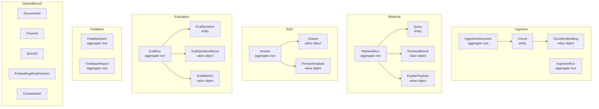

# Aggregates — Consolidated View

This file lists every aggregate across all bounded contexts, their aggregate
roots, consistency boundaries, and the invariants that protect them.

> Derived from `docs/prd.md` §§7, 8, 11 and the context files in
> `docs/ddd/contexts/`.

---

## Overview

---

## Aggregate Inventory

### 1. `IngestionDocument` (Ingestion context)

| Property          | Value                                               |
|-------------------|-----------------------------------------------------|
| Aggregate Root    | `IngestionDocument`                                 |
| Owned Entities    | `Chunk` (ordered list)                              |
| Owned VOs         | `ChunkEmbedding` (per Chunk), `ChunkingConfig`, `ContentHash`, `EmbeddingModelVersion` |
| Repository        | `IngestionDocumentRepository`                       |
| Identity Key      | `DocumentId` (+ natural key: `sourcePath`)          |

**Invariants:**

| # | Invariant | PRD Reference |
|---|-----------|---------------|
| I1 | No two active IngestionDocuments share the same `sourcePath` + `contentHash`. Re-ingesting an unchanged file is a no-op. | FR-ING-003 |
| I2 | All Chunks within one IngestionDocument must share the same `EmbeddingModelVersion`. | FR-EMB-001, Risk 5 |
| I3 | `Chunk.tokenCount` must not exceed `ChunkingConfig.maxChunkTokens`. | FR-CHK-002 |
| I4 | No Chunk may span a fenced code block boundary. | FR-CHK-001, Risk 4 |
| I5 | A soft-deleted IngestionDocument's Chunks must not appear in search results. | FR-ING-004 |
| I6 | `ChunkEmbedding.vector.length` must equal `ChunkEmbedding.modelVersion.dimension`. | FR-EMB-001 |

---

### 2. `IngestionRun` (Ingestion context)

| Property          | Value                                               |
|-------------------|-----------------------------------------------------|
| Aggregate Root    | `IngestionRun`                                      |
| Owned Entities    | `IngestionError[]` (value objects)                  |
| Repository        | `IngestionRunRepository`                            |
| Identity Key      | `IngestionRun.id`                                   |

**Invariants:**

| # | Invariant | PRD Reference |
|---|-----------|---------------|
| I7 | A single file ingestion error does not abort the run unless `--force` is absent and a configurable error-limit is exceeded. | §9.5 |
| I8 | `completedAt` is only set when `status` is terminal (`completed` or `failed`). | General |

---

### 3. `RetrievalRun` (Retrieval context)

| Property          | Value                                               |
|-------------------|-----------------------------------------------------|
| Aggregate Root    | `RetrievalRun`                                      |
| Owned Entities    | `Query` (embedded)                                  |
| Owned VOs         | `RetrievalResult[]`, `ExplainPayload?`              |
| Repository        | `RetrievalRunRepository`                            |
| Identity Key      | `RetrievalRun.id`                                   |

**Invariants:**

| # | Invariant | PRD Reference |
|---|-----------|---------------|
| I9 | A RetrievalRun is immutable once completed — results are never modified after creation. | §7 Observability |
| I10 | If the Query's `embeddingModel` differs from the active index's `EmbeddingModelVersion`, the run fails before executing — never silently mixes dimensions. | FR-EMB-002, Risk 5 |
| I11 | `results.length` <= `query.topK`. | FR-SRCH-001 |
| I12 | `results` are ordered by rank ascending (rank 1 = best match). | FR-SRCH-001 |
| I13 | `latencyMs` is always recorded. | §9.3 |

---

### 4. `Answer` (Answer Generation context)

| Property          | Value                                               |
|-------------------|-----------------------------------------------------|
| Aggregate Root    | `Answer`                                            |
| Owned VOs         | `Citation[]`, `PromptTemplate` (version snapshot)  |
| Repository        | `AnswerRepository`                                  |
| Identity Key      | `Answer.id`                                         |

**Invariants:**

| # | Invariant | PRD Reference |
|---|-----------|---------------|
| I14 | If `noAnswerReason` is absent, `citations` must be non-empty. An answer without citations is invalid. | §7 "Sources Are Mandatory", FR-RAG-002 |
| I15 | If `noAnswerReason` is present, `answerText` must be a non-empty explanation for the user (not a hallucinated answer). | FR-RAG-003 |
| I16 | All `Citation.chunkId` values must be drawn from the associated RetrievalRun's results — no invented citations. | FR-RAG-002 |
| I17 | `promptTemplateVersion` is always recorded. | FR-RAG-004 |
| I18 | The Answer Generation context never queries the vector store directly; it only consumes RetrievalRun output. | §7 "Retrieval Before Generation" |

---

### 5. `EvalRun` (Evaluation context)

| Property          | Value                                               |
|-------------------|-----------------------------------------------------|
| Aggregate Root    | `EvalRun`                                           |
| Owned Entities    | `EvalQuestion[]` (loaded from file, not persisted)  |
| Owned VOs         | `EvalQuestionResult[]`, `EvalMetrics`, `ThresholdConfig?` |
| Repository        | `EvalRunRepository`                                 |
| Identity Key      | `EvalRunId`                                         |

**Invariants:**

| # | Invariant | PRD Reference |
|---|-----------|---------------|
| I19 | `questionResults.length` equals dataset size when the run completes successfully. | FR-EVAL-002 |
| I20 | `metrics` (Hit@K, MRR) is only set when status is terminal. | FR-EVAL-002 |
| I21 | If `thresholdConfig.minHitAt3` is set and `metrics.hitAt3` < that threshold, status becomes `"threshold_failed"` and CLI exits non-zero. | FR-EVAL-003 |
| I22 | All metric rates (`hitAt1`, `hitAt3`, `hitAt5`, `mrr`) are in [0.0, 1.0]. | General |

---

### 6. `FeedbackItem` (Feedback context)

| Property          | Value                                               |
|-------------------|-----------------------------------------------------|
| Aggregate Root    | `FeedbackItem`                                      |
| Owned VOs         | `FeedbackRating`                                    |
| Repository        | `FeedbackRepository`                                |
| Identity Key      | `FeedbackId`                                        |

**Invariants:**

| # | Invariant | PRD Reference |
|---|-----------|---------------|
| I23 | `queryId` must reference an existing Query at creation time. | FR-FB-001 |
| I24 | `chunkId` must reference an existing Chunk at creation time. | FR-FB-001 |
| I25 | FeedbackItems are append-only — never modified or deleted. | §8.8 |
| I26 | `rating` is exactly `"good"` or `"bad"`. | FR-FB-001 |

---

### 7. `FeedbackReport` (Feedback context)

| Property          | Value                                               |
|-------------------|-----------------------------------------------------|
| Aggregate Root    | `FeedbackReport`                                    |
| Owned VOs         | `ProblematicQuery[]`, `DownvotedChunk[]`, `NoGoodResultQuery[]`, `RechunkingCandidate[]` |
| Repository        | None — computed on demand, not persisted            |
| Identity Key      | Ephemeral `id` for correlation                      |

**Invariants:**

| # | Invariant | PRD Reference |
|---|-----------|---------------|
| I27 | `badRatio` in ProblematicQuery is in [0.0, 1.0]. | General |
| I28 | RechunkingCandidates are surface-only recommendations — the report never initiates re-chunking. | FR-FB-002, FR-FB-003 |

---

## Cross-Aggregate Consistency Rules

These rules span aggregate boundaries and are enforced by domain events
and application orchestrators, not within a single aggregate transaction.

| Rule | Description |
|------|-------------|
| C1 | When a new EmbeddingModelVersion is activated, all active Chunks must be re-embedded before the Retrieval context accepts new queries with that model. Enforced by: `ReEmbedCommand` → `EmbeddingsGenerated` event → Retrieval validates `getIndexedModelVersion()`. |
| C2 | An Answer must be based on a completed RetrievalRun. The Answer aggregate stores `retrievalRunId` as a foreign reference — if the RetrievalRun does not exist, Answer creation is rejected. |
| C3 | A FeedbackItem's `queryId` must correspond to a Query that has at least one associated RetrievalRun. Validated through `QueryValidationPort`. |
| C4 | An EvalRun's `searchMode` must be a valid `SearchMode` enum value. EvalRuns comparing multiple modes are separate EvalRun instances — not merged. |
