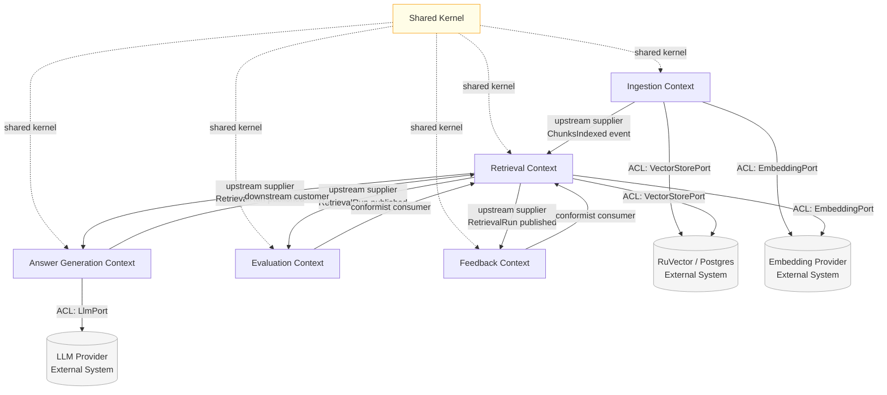

# Context Map — tovli

This file describes the bounded contexts that make up the tovli system and
the relationships between them.

> Derived from `docs/prd.md` §§7, 10, 15.

---

## Bounded Contexts

| Context              | Short Name    | Description                                          |
|----------------------|---------------|------------------------------------------------------|
| Shared Kernel        | `shared`      | Common identifiers and value objects                 |
| Ingestion            | `ingestion`   | Document parsing, chunking, embedding, storage       |
| Retrieval            | `retrieval`   | Vector/keyword/hybrid search and explain             |
| Answer Generation    | `rag`         | LLM-based cited answer synthesis                     |
| Evaluation           | `evaluation`  | Retrieval quality measurement (Hit@K, MRR)           |
| Feedback             | `feedback`    | User ratings and quality reporting                   |

External systems (behind ACLs, not bounded contexts):

| System                 | Role                                               |
|------------------------|----------------------------------------------------|
| RuVector / Postgres    | Vector store and relational persistence            |
| Embedding Provider     | Produces dense vectors for Chunks and Queries      |
| LLM Provider           | Generates natural-language answers from context    |

---

## Context Relationship Diagram

---

## Relationship Descriptions

### Shared Kernel (all contexts)
All five contexts share a small kernel of value objects and identifiers:
`DocumentId`, `ChunkId`, `QueryId`, `EmbeddingModelVersion`, `ContentHash`.
Changes to the Shared Kernel require coordination across all teams/modules.
See [`contexts/shared-kernel.md`](contexts/shared-kernel.md).

### Ingestion → Retrieval (Upstream Supplier / Downstream Customer)
Ingestion is the upstream supplier. It produces indexed Chunks and publishes
`ChunksIndexed` events. Retrieval is the downstream customer — it consumes
the vector index that Ingestion populates. Retrieval must not bypass Ingestion
to write directly to the vector store.

The relationship is **customer-supplier**: the Ingestion team owns the
contract (which Chunks are stored, in which EmbeddingModelVersion). Retrieval
must conform to whatever Ingestion has indexed, and may request contract
extensions (e.g. new metadata fields) through the Ingestion team.

### Retrieval → Answer Generation (Upstream Supplier / Downstream Customer)
Retrieval is the upstream supplier that publishes `SearchExecuted` events
(RetrievalRun outputs). Answer Generation is the downstream customer that
consumes those results to assemble LLM context. Answer Generation must never
query the vector store directly — it must receive a RetrievalRun as input.
This enforces the "Retrieval Before Generation" principle.

### Retrieval → Evaluation (Conformist)
Evaluation conforms to the Retrieval context's output model (RetrievalRun).
Evaluation does not need Retrieval to change its API — it simply observes runs
and computes metrics. If Retrieval changes its output shape, Evaluation must
adapt.

### Retrieval → Feedback (Conformist)
Feedback similarly conforms to Retrieval's output. A Feedback item always
references a `QueryId` and `ChunkId` from a RetrievalRun. Feedback does not
need to know anything about how the retrieval was performed.

### External Systems (Anti-Corruption Layers)

**RuVector / Postgres ACL (`VectorStorePort`)**
Both Ingestion and Retrieval interact with RuVector/Postgres. The domain
model never uses pg driver types or RuVector-specific SQL directly. All
access goes through a `VectorStorePort` interface defined in the domain.
Motivation: PRD Risk 1 — RuVector APIs may be unstable.

**Embedding Provider ACL (`EmbeddingPort`)**
Both Ingestion (to index Chunks) and Retrieval (to embed the Query) call an
embedding provider. The provider is abstracted behind an `EmbeddingPort`
interface. The domain model holds an `EmbeddingModelVersion` value object;
it never holds provider SDK types. Motivation: PRD Risk 5 — embedding model
changes may corrupt quality.

**LLM Provider ACL (`LlmPort`)**
Only the Answer Generation context calls the LLM. The `LlmPort` interface
accepts a typed prompt (retrieved Chunks + question) and returns a typed
response (answer text + which chunks were cited). Motivation: PRD Risk 3 —
LLM answers may hallucinate; the domain enforces citation as an invariant
rather than trusting the LLM to provide them.

---

## Published Language

The following domain events constitute the published language between contexts.
Full payloads are in [`domain-events.md`](domain-events.md).

| Event                    | Publisher   | Subscribers                        |
|--------------------------|-------------|------------------------------------|
| `DocumentIngested`       | Ingestion   | (internal log)                     |
| `ChunksCreated`          | Ingestion   | (internal log)                     |
| `EmbeddingsGenerated`    | Ingestion   | (internal log)                     |
| `ChunksIndexed`          | Ingestion   | Retrieval                          |
| `SearchExecuted`         | Retrieval   | Answer Generation, Evaluation, Feedback |
| `AnswerGenerated`        | RAG         | (internal log)                     |
| `EvaluationCompleted`    | Evaluation  | (internal log / CI)                |
| `FeedbackRecorded`       | Feedback    | (internal log)                     |
