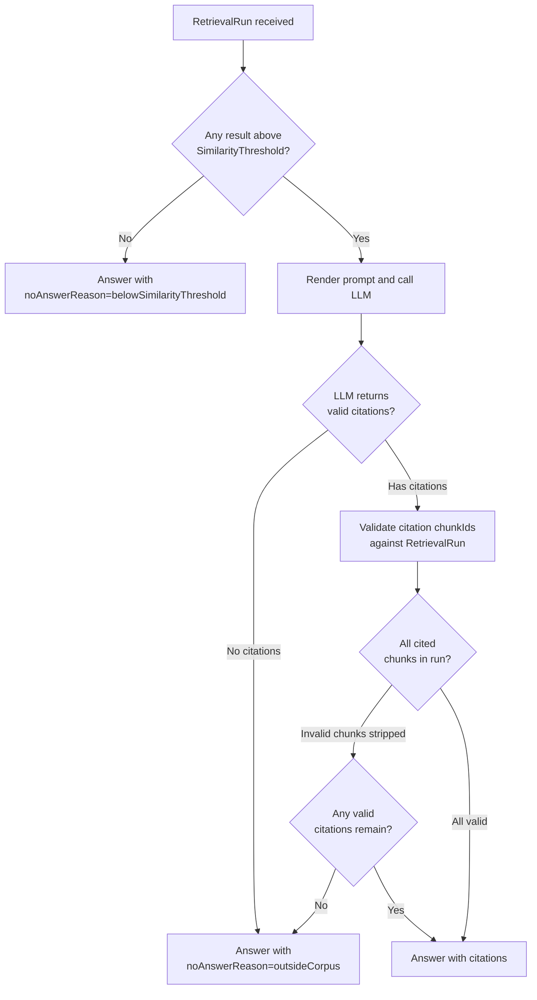

# Answer Generation Bounded Context (RAG)

> Source: `docs/prd.md` §§8.6, §10, §7, §15.

---

## Purpose and Responsibility

The Answer Generation context takes the output of a completed RetrievalRun
and produces a natural-language Answer grounded in those retrieved Chunks.
It is responsible for:

- Receiving a `SearchExecuted` event (or being called with a RetrievalRun id)
  as its sole source of retrieved context.
- Assembling an LLM prompt from retrieved Chunks using a versioned
  PromptTemplate.
- Calling the LLM provider via the `LlmPort` ACL.
- Enforcing that every Answer carries at least one Citation.
- Detecting weak retrieval (all scores below SimilarityThreshold) and
  producing a NoAnswerResponse instead of hallucinating.
- Storing Answer logs with the prompt version for later regression testing.
- Publishing `AnswerGenerated` events.

The Answer Generation context does NOT perform retrieval. It reads the
RetrievalRun it receives but never queries the vector store directly.
This enforces the "Retrieval Before Generation" principle (PRD §7).

---

## Aggregates

### `Answer` (Aggregate Root)

The authoritative record of one answer generation attempt.

```typescript
type Answer = {
  id: string;                     // "ans_..."
  queryId: QueryId;
  retrievalRunId: string;         // the RetrievalRun this answer is based on
  promptTemplateVersion: string;  // e.g. "v1.2.0"
  answerText: string;             // empty string when noAnswerReason is set
  citations: Citation[];          // MUST be non-empty unless noAnswerReason
  retrievedButUnusedChunks: ChunkId[]; // for debug mode
  noAnswerReason?: NoAnswerReason;
  llmProvider: string;            // e.g. "openai/gpt-4o"
  latencyMs: number;
  createdAt: string;
};

type NoAnswerReason =
  | "belowSimilarityThreshold"   // all retrieval scores below threshold
  | "sourcesConflict"            // retrieved chunks contradict each other
  | "outsideCorpus"              // LLM determined the question is out of scope
  | "llmProviderError";          // external LLM call failed
```

**Invariants:**
1. If `noAnswerReason` is absent, `citations` must contain at least one
   Citation. An Answer with no citations and no noAnswerReason is invalid.
   This is the primary invariant protecting the "Sources Are Mandatory"
   principle (PRD §7, FR-RAG-002).
2. If `noAnswerReason` is present, `answerText` should be a short
   explanation for the user (never an empty string — the user must be told
   why there is no answer, PRD §8.6 FR-RAG-003).
3. `promptTemplateVersion` is always recorded, even for no-answer responses,
   to support prompt regression testing (FR-RAG-004).
4. `citations` reference only ChunkIds that appeared in the associated
   RetrievalRun. The Answer Generation context may not invent citations.

---

## Value Objects

### Citation

```typescript
type Citation = {
  readonly rank: number;          // rank position from the RetrievalRun
  readonly chunkId: ChunkId;
  readonly sourcePath: string;
  readonly headingPath: string[];
  readonly preview: string;
};
```

Citations are derived from the RetrievalRun results. They are not independently
stored — they live within the Answer aggregate.

Formatted output example (PRD §8.6 FR-RAG-002):
```
Sources:
1. docs/architecture.md#chunk-12
2. docs/react-native-conventions.md#chunk-4
```

---

### PromptTemplate (Value Object)

```typescript
type PromptTemplate = {
  readonly version: string;       // semver or git hash
  readonly systemPrompt: string;
  readonly contextTemplate: string; // uses {{chunks}} placeholder
  readonly instructions: string;  // enforces citation format
};
```

PromptTemplates live in source control. The version string is immutable once
deployed — changing the prompt requires a new version string.

---

### RetrievedContext (Value Object, constructed inside this context)

```typescript
type RetrievedContext = {
  readonly queryText: string;
  readonly chunks: ContextChunk[];
  readonly searchMode: SearchMode;
};

type ContextChunk = {
  readonly rank: number;
  readonly chunkId: ChunkId;
  readonly sourcePath: string;
  readonly headingPath: string[];
  readonly content: string;
  readonly score: number;
};
```

`RetrievedContext` is assembled from the `SearchExecuted` event payload and
passed to the PromptTemplate renderer. It is the bridge between Retrieval's
output model and the LLM prompt format.

---

## Domain Events

| Event              | Trigger                                                 |
|--------------------|---------------------------------------------------------|
| `AnswerGenerated`  | An Answer (with citations or a noAnswerReason) is saved |

Event payloads are in [`../domain-events.md`](../domain-events.md).

---

## Repository Interfaces

```typescript
interface AnswerRepository {
  save(answer: Answer): Promise<void>;
  findById(id: string): Promise<Answer | null>;
  findByQueryId(queryId: QueryId): Promise<Answer[]>;
  findByPromptVersion(version: string): Promise<Answer[]>; // for regression
}

interface PromptTemplateRepository {
  findByVersion(version: string): Promise<PromptTemplate | null>;
  findActive(): Promise<PromptTemplate>;
  save(template: PromptTemplate): Promise<void>;
}
```

---

## Domain Services

### `RagAnswerService` (Domain Service, depends on LlmPort ACL)

```typescript
interface RagAnswerService {
  generateAnswer(
    query: Query,
    retrievalRun: RetrievalRun,
    options?: { showContext?: boolean }
  ): Promise<Answer>;
}
```

Internal steps:
1. Check if any RetrievalResult exceeds `SimilarityThreshold`. If none do,
   immediately produce an Answer with `noAnswerReason: "belowSimilarityThreshold"`.
2. Load the active `PromptTemplate`.
3. Build `RetrievedContext` from the RetrievalRun results.
4. Render the prompt via the template.
5. Call `LlmPort.complete(prompt)`.
6. Parse the LLM response to extract `answerText` and cited chunk IDs.
7. Validate that cited chunk IDs exist in the RetrievalRun (no invented
   citations). Strip any claimed citations that are not in the run.
8. Enforce the citations-non-empty invariant. If the LLM returned an answer
   but zero valid citations, convert to `noAnswerReason: "outsideCorpus"`.
9. Persist the Answer and publish `AnswerGenerated`.

### `ContextAssemblyService` (Domain Service)

Responsibility: transform a RetrievalRun into a `RetrievedContext` value object
suitable for prompt rendering. Trims content to fit token budget if needed.
Does not call any external service.

---

## Anti-Corruption Layer

### `LlmPort` (ACL — wraps LLM Provider)

```typescript
interface LlmPort {
  complete(request: LlmRequest): Promise<LlmResponse>;
  isAvailable(): Promise<boolean>;
}

type LlmRequest = {
  systemPrompt: string;
  userMessage: string;    // rendered template with chunks + question
  maxTokens: number;
};

type LlmResponse = {
  text: string;
  citedChunkIds: string[]; // LLM is instructed to output structured citations
  finishReason: "stop" | "length" | "error";
  provider: string;
  latencyMs: number;
};
```

The domain never holds LLM SDK client objects or API keys. These live entirely
in the adapter implementation. If `isAvailable()` returns false, `RagAnswerService`
produces `noAnswerReason: "llmProviderError"` without calling `complete`.

**Why this matters:** PRD Risk 3 — LLM answers may hallucinate. The domain
enforces the citation invariant independently of the LLM; the LLM is only
trusted for fluent text generation, not for correctness of sources.

---

## No-Answer Policy (from PRD §7 and FR-RAG-003)



---

## Directory Layout (reference)

```
src/
└── answer-generation/
    ├── domain/
    │   ├── Answer.ts
    │   ├── Citation.ts
    │   ├── PromptTemplate.ts
    │   ├── RetrievedContext.ts
    │   ├── events/
    │   │   └── AnswerGenerated.ts
    │   └── ports/
    │       └── LlmPort.ts
    ├── application/
    │   ├── RagAnswerService.ts
    │   └── ContextAssemblyService.ts
    └── infrastructure/
        ├── OpenAiLlmAdapter.ts
        └── LocalLlmAdapter.ts
```
