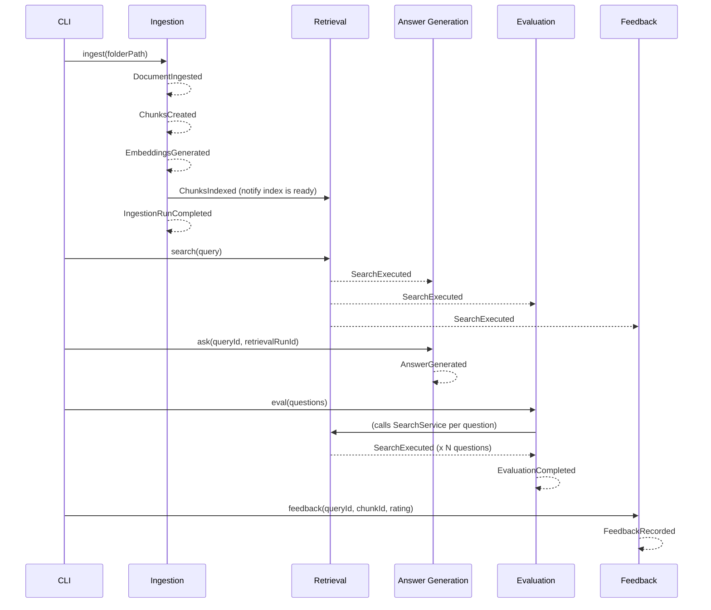

# Domain Events — Catalog

This file catalogs every domain event in the tovli system, the context that
publishes it, the contexts that subscribe to it, and a payload sketch.

> Derived from `docs/prd.md` §§7, 8, 10. Event names use past-tense verbs
> (something that happened, not a command). Payloads use TypeScript-flavored
> type sketches consistent with PRD §11.

---

## Event Flow Diagram



---

## Ingestion Context Events

### `DocumentIngested`

Published when a Document is created or re-ingested (changed content hash).

```typescript
type DocumentIngested = {
  eventType: "DocumentIngested";
  eventId: string;
  occurredAt: string;               // ISO-8601
  payload: {
    documentId: DocumentId;
    sourcePath: string;
    fileName: string;
    fileExtension: string;
    contentHash: string;            // hex
    project?: string;
    tags: string[];
    isUpdate: boolean;              // false = new, true = re-ingested after change
    ingestionRunId: string;
  };
};
```

Publisher: Ingestion
Subscribers: (observability log — no downstream context reacts structurally)

---

### `DocumentDeleted`

Published when a source file is no longer present and its document is
soft-deleted.

```typescript
type DocumentDeleted = {
  eventType: "DocumentDeleted";
  eventId: string;
  occurredAt: string;
  payload: {
    documentId: DocumentId;
    sourcePath: string;
    ingestionRunId: string;
  };
};
```

Publisher: Ingestion
Subscribers: (log; Retrieval implicitly excludes deleted docs via index state)

---

### `ChunksCreated`

Published when chunking is complete for one Document within an IngestionRun.

```typescript
type ChunksCreated = {
  eventType: "ChunksCreated";
  eventId: string;
  occurredAt: string;
  payload: {
    documentId: DocumentId;
    ingestionRunId: string;
    chunkCount: number;
    chunkIds: ChunkId[];
    chunkingConfig: {
      targetChunkTokens: number;
      maxChunkTokens: number;
      overlapTokens: number;
    };
    averageTokenCount: number;
  };
};
```

Publisher: Ingestion (ChunkingService)
Subscribers: EmbeddingService (within Ingestion pipeline — internal event)

---

### `EmbeddingsGenerated`

Published when embeddings are stored for all Chunks of one Document.

```typescript
type EmbeddingsGenerated = {
  eventType: "EmbeddingsGenerated";
  eventId: string;
  occurredAt: string;
  payload: {
    documentId: DocumentId;
    ingestionRunId: string;
    chunkCount: number;
    embeddingModelName: string;
    embeddingDimension: number;
    embeddingProvider: string;      // e.g. "openai", "local", "mock"
  };
};
```

Publisher: Ingestion (EmbeddingService)
Subscribers: (log; VectorStorePort write follows immediately in pipeline)

---

### `ChunksIndexed`

Published when all Chunks and Embeddings for an IngestionRun are persisted
and the index is queryable. This is the event that signals Retrieval that
new content is available.

```typescript
type ChunksIndexed = {
  eventType: "ChunksIndexed";
  eventId: string;
  occurredAt: string;
  payload: {
    ingestionRunId: string;
    documentCount: number;
    totalChunksIndexed: number;
    embeddingModelName: string;
    embeddingDimension: number;
    indexedAt: string;
  };
};
```

Publisher: Ingestion
Subscribers: Retrieval (invalidates any cached model version assumption)

---

### `IngestionRunCompleted`

Published when an IngestionRun finishes, whether fully successful or with
partial errors.

```typescript
type IngestionRunCompleted = {
  eventType: "IngestionRunCompleted";
  eventId: string;
  occurredAt: string;
  payload: {
    ingestionRunId: string;
    status: "completed" | "failed";
    folderPath: string;
    filesScanned: number;
    filesIngested: number;
    filesSkipped: number;
    filesErrored: number;
    chunksCreated: number;
    embeddingsGenerated: number;
    durationMs: number;
    errors: Array<{ sourcePath: string; reason: string }>;
  };
};
```

Publisher: Ingestion
Subscribers: CLI (prints summary to user)

---

## Retrieval Context Events

### `SearchExecuted`

The most important cross-context event. Published when a RetrievalRun
completes. Answer Generation, Evaluation, and Feedback all react to this.

```typescript
type SearchExecuted = {
  eventType: "SearchExecuted";
  eventId: string;
  occurredAt: string;
  payload: {
    retrievalRunId: string;
    queryId: QueryId;
    questionText: string;
    searchMode: SearchMode;
    topK: number;
    filtersApplied: MetadataFilter;
    embeddingModelName: string;
    embeddingDimension: number;
    latencyMs: number;
    resultCount: number;
    belowThresholdCount: number;
    results: Array<{
      rank: number;
      chunkId: ChunkId;
      documentId: DocumentId;
      sourcePath: string;
      score: number;
      preview: string;
      headingPath: string[];
    }>;
    explain?: {
      rankingMethod: string;
      queryEmbeddingProvider: string;
    };
  };
};
```

Publisher: Retrieval
Subscribers: Answer Generation, Evaluation, Feedback

Note: The full `results` array is included in the payload so that downstream
contexts (especially RAG and Evaluation) do not need to make a round-trip
query to read the RetrievalRun. This is a deliberate denormalisation for
observability and loose coupling.

---

### `SearchFailed`

Published when a RetrievalRun cannot complete (e.g. embedding model mismatch,
vector store connection failure).

```typescript
type SearchFailed = {
  eventType: "SearchFailed";
  eventId: string;
  occurredAt: string;
  payload: {
    queryId: QueryId;
    questionText: string;
    searchMode: SearchMode;
    reason: "EmbeddingModelMismatch" | "VectorStoreUnavailable" | "EmbeddingProviderError" | "Unknown";
    detail: string;
    activeIndexModelName?: string;
    queryModelName?: string;
  };
};
```

Publisher: Retrieval
Subscribers: CLI (surfaces error to user with remediation guidance)

---

## Answer Generation Context Events

### `AnswerGenerated`

Published when an Answer is persisted, whether it contains a full answer
with citations or a no-answer response.

```typescript
type AnswerGenerated = {
  eventType: "AnswerGenerated";
  eventId: string;
  occurredAt: string;
  payload: {
    answerId: string;
    queryId: QueryId;
    retrievalRunId: string;
    promptTemplateVersion: string;
    hasAnswer: boolean;             // false when noAnswerReason is set
    noAnswerReason?: string;
    citationCount: number;
    citedChunkIds: ChunkId[];
    llmProvider: string;
    latencyMs: number;
  };
};
```

Publisher: Answer Generation
Subscribers: (log; CLI prints the answer to user)

---

## Evaluation Context Events

### `EvaluationCompleted`

Published when an EvalRun finishes. Carries the full metrics summary so CI
can parse it without reading a file.

```typescript
type EvaluationCompleted = {
  eventType: "EvaluationCompleted";
  eventId: string;
  occurredAt: string;
  payload: {
    evalRunId: EvalRunId;
    status: "completed" | "threshold_failed";
    searchMode: SearchMode;
    topK: number;
    embeddingModelName?: string;
    questionCount: number;
    metrics: {
      hitAt1: number;
      hitAt3: number;
      hitAt5: number;
      mrr: number;
      avgLatencyMs: number;
      emptyResultCount: number;
      belowThresholdCount: number;
    };
    thresholdFailed: boolean;
    minHitAt3Threshold?: number;
    reportPath?: string;
  };
};
```

Publisher: Evaluation
Subscribers: CLI (prints report, exits non-zero if `thresholdFailed`)

---

## Feedback Context Events

### `FeedbackRecorded`

Published when a FeedbackItem is saved.

```typescript
type FeedbackRecorded = {
  eventType: "FeedbackRecorded";
  eventId: string;
  occurredAt: string;
  payload: {
    feedbackId: FeedbackId;
    queryId: QueryId;
    chunkId: ChunkId;
    rating: "good" | "bad";
    sourcePath: string;
    hasNote: boolean;
  };
};
```

Publisher: Feedback
Subscribers: (log; no structural downstream reaction in current model)

---

## Event Naming Conventions

- All event names are **past-tense** noun-verb compounds: `DocumentIngested`,
  not `IngestDocument` or `DocumentIngest`.
- `eventId` is a UUID (v4) generated at publication time.
- `occurredAt` is the ISO-8601 wall-clock time at which the domain action
  completed, not the time the event was enqueued.
- All payload fields use `camelCase`.
- Events are immutable once published. A corrective action publishes a new
  event, not a mutation of a past event.

---

## Event Transport

In the current local-first architecture, events are delivered in-process
(synchronous observer pattern or simple async emit). There is no message
broker. The event types above define the contract; if a message broker is
added later (for the API or bot layer), these payloads become the wire format
with no changes to the domain.
